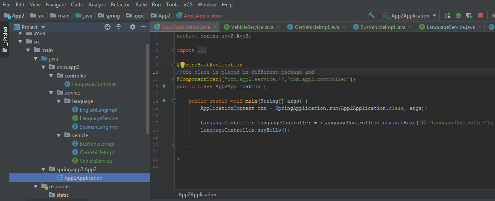

### Dependency Injection

### Inversion of Control

### @AutoWired
 - Used for dependecny injection of bean with the interface type of concrete class.
  
### @Controller
 - In this SpringBoot application, we use the controller to bridge the @Component layer.
 - The *@SpringBootApplication* annotated class, creates a *ApplicationContext* and looks for the **@Controller** annoated bean class.
```
  public static void main(String[] args) {
     ApplicationContext ctx = SpringApplication.run(App2Application.class, args);
     LanguageController languageController = (LanguageController) ctx.getBean("languageController");
     languageController.sayHello();
  }
```
 
### @Profile
   - @Profile annoation comes handy when it is necessary to active the use of class by controlling them form *application.properties*
   - For example, using in memory database for a local development and latter enabling the required database implementation, etc.
   - The profile with the default will be used if the applicaiton.properties was not provided for any active value. 
   ```
   in java class:
        @Profile("name") or
        @Profile({"default","name1"})
   in applicaton.properties
        spring.profiles.active=name1
   ```
##### If class is not marked with *@Profile(default)*, and there is no active entries in application.properties file, spring will not be able to resolve between the English or Spanish language component beans
 - To fix this issue 
 	- use *@Profile({"default","english"})* **or**
	- activate the profile in application.properties using *spring.profiles.active=english*
```
 Caused by: org.springframework.beans.factory.BeanCreationException: Could not autowire field: private com.app2.Service.LanguageService com.app2.HelloWorld.languageService; nested exception is org.springframework.beans.factory.NoSuchBeanDefinitionException: No qualifying bean of type [com.app2.Service.LanguageService] found for dependency: expected at least 1 bean which qualifies as autowire candidate for this dependency. Dependency annotations: {@org.springframework.beans.factory.annotation.Autowired(required=true)}
	at 
...
org.springframework.beans.factory.support.DefaultListableBeanFactory.raiseNoSuchBeanDefinitionException(DefaultListableBeanFactory.java:1301)
	at org.springframework.beans.factory.support.DefaultListableBeanFactory.doResolveDependency(DefaultListableBeanFactory.java:1047)
```

### @ComponentScan
  - @CompoenentScan annotation is used to tell spring to load the @Component,@Repository, etc. annoation to be resolved to the spring context from the specific package.
  - Use this annotation in the class which has the *@SpringBootApplication*.
  - The annotation can take wildcards to scan pacakge, consider the performance when using wild card
```
  @ComponentScan("com.app2") 
  @ComponentScan({"package1","package2"})
```


### Java configuration using @Configuration
  - For example, a datasource java bean or pojo class in an external jar that needs to be loaded to the Spring context, this can be configured in Spring using **@Configuration** and **@Bean**.
  - If the dataource interface has multiple implemenation, then use the **@Profile** annoatation within **@Bean** to resolve.
  - In the example below, the controller is used to autowire the beans.

```
public interface VehicleService {
    public String vehicleType();
}
---
public class CarVehicleImpl implements VehicleService{
    @Override
    public String vehicleType() {
        return "Car";
    }
}
---
public class BusVehicleImpl implements VehicleService {
    @Override
    public String vehicleType() {
        return "Bus";
    }
---
@Configuration
public class VehicleConfig {
    @Bean
    @Profile("bus")
    public VehicleService busService(){
        return new BusVehicleImpl();
    }
    @Bean
    @Profile({"default","car"}) 
    //Note: in @Profile if not default is mentioned, spring will not be able to resolve 
    //the bean and throws exception
    public VehicleService carService(){
        return new CarVehicleImpl();
    }
}
```


